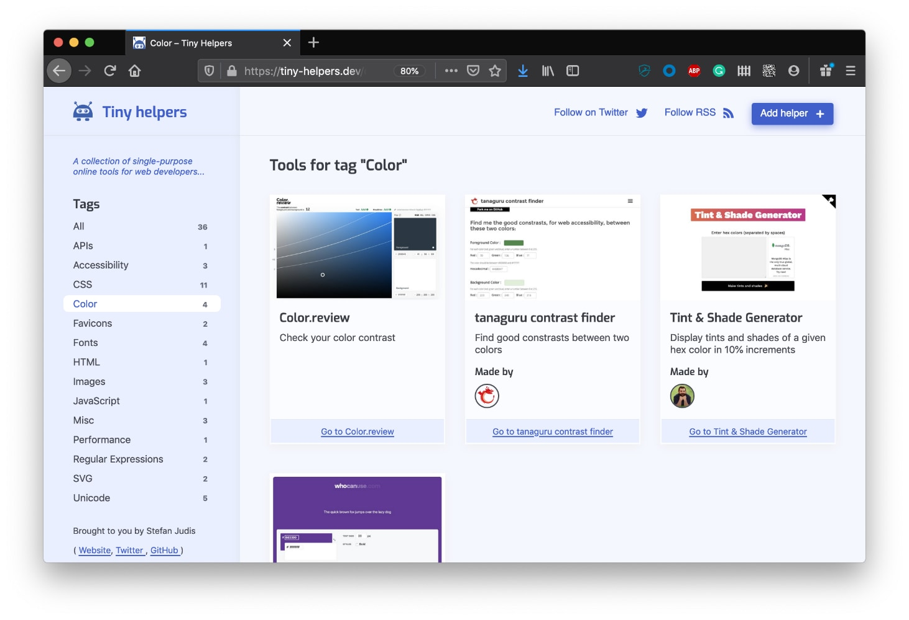

# tiny-helpers.dev

> A collection of useful online web development tools.



## Contributing

Make sure you have a recent version of [Node.js installed](https://nodejs.org/en/) (we recommend at least version `v12.14.`). After installing Node.js you'll have the `node` but also the [`npm`](https://www.npmjs.com/) command available. npm is Node.js' package manager.

**Additionally, please have a look at the [CONTRIBUTING.md](./CONTRIBUTING.md) including further information about what counts as a tiny helper.**

Fork and clone this repository. Head over to your terminal and run the following command:

```
git clone git@github.com:[YOUR_USERNAME]/tiny-helpers.git
cd tiny-helpers
npm ci
npm run helper:add
```

### Add a new helper

`npm run helper:add` will ask a few questions and create a file in `helpers/`.
Commit the changes and [open a pull request](https://help.github.com/en/github/collaborating-with-issues-and-pull-requests/creating-a-pull-request).

### Run the project locally

This project uses Vercel's routing configuration. The `/` route doesn't work locally. To start, navigate to `localhost:8080/home/` after running `npm run dev`.

```
npm run dev
```
## Contributors :sparkles:
<table>
<tr>
                <td align="center">
                    <a href="https://github.com/stefanjudis">
                        
                        <br />
                        <sub><b>Stefan Judis</b></sub>
                    </a>
                </td>
                <td align="center">
                    <a href="https://github.com/fhemberger">
                        
                        <br />
                        <sub><b>Frederic Hemberger</b></sub>
                    </a>
                </td>
                <td align="center">
                    <a href="https://github.com/nikitahl">
                        
                        <br />
                        <sub><b>Nikita Hlopov</b></sub>
                    </a>
                </td>
                <td align="center">
                    <a href="https://github.com/akx">
                        
                        <br />
                        <sub><b>Aarni Koskela</b></sub>
                    </a>
                </td>
                <td align="center">
                    <a href="https://github.com/0xadada">
                        
                        <br />
                        <sub><b>0xADADA</b></sub>
                    </a>
                </td>
                <td align="center">
                    <a href="https://github.com/mrassili">
                        
                        <br />
                        <sub><b>Marouane R</b></sub>
                    </a>
                </td>
                <td align="center">
                    <a href="https://github.com/Ben1980">
                        
                        <br />
                        <sub><b>Benjamin Mahr</b></sub>
                    </a>
                </td>
                <td align="center">
                    <a href="https://github.com/manniL">
                        
                        <br />
                        <sub><b>Alexander Lichter</b></sub>
                    </a>
                </td>
                <td align="center">
                    <a href="https://github.com/CanRau">
                        
                        <br />
                        <sub><b>Can Rau</b></sub>
                    </a>
                </td>
                <td align="center">
                    <a href="https://github.com/bjuretko">
                        
                        <br />
                        <sub><b>Benedict Juretko</b></sub>
                    </a>
                </td>
                <td align="center">
                    <a href="https://github.com/Kilian">
                        
                        <br />
                        <sub><b>Kilian Valkhof</b></sub>
                    </a>
                </td></tr>
<tr>
                <td align="center">
                    <a href="https://github.com/philnash">
                        
                        <br />
                        <sub><b>Phil Nash</b></sub>
                    </a>
                </td>
                <td align="center">
                    <a href="https://github.com/remy">
                        
                        <br />
                        <sub><b>Remy Sharp</b></sub>
                    </a>
                </td>
                <td align="center">
                    <a href="https://github.com/Sjeiti">
                        
                        <br />
                        <sub><b>Ron Valstar</b></sub>
                    </a>
                </td>
                <td align="center">
                    <a href="https://github.com/TomTasche">
                        
                        <br />
                        <sub><b>Thomas Taschauer</b></sub>
                    </a>
                </td>
                <td align="center">
                    <a href="https://github.com/axe312ger">
                        
                        <br />
                        <sub><b>Benedikt Rötsch</b></sub>
                    </a>
                </td>
                <td align="center">
                    <a href="https://github.com/nicokoenig">
                        
                        <br />
                        <sub><b>Nico König</b></sub>
                    </a>
                </td>
                <td align="center">
                    <a href="https://github.com/bkmxer">
                        
                        <br />
                        <sub><b>Anton Ilchuk</b></sub>
                    </a>
                </td>
                <td align="center">
                    <a href="https://github.com/austinpray">
                        
                        <br />
                        <sub><b>Austin Pray</b></sub>
                    </a>
                </td>
                <td align="center">
                    <a href="https://github.com/caseymhunt">
                        
                        <br />
                        <sub><b>Casey Hunt</b></sub>
                    </a>
                </td>
                <td align="center">
                    <a href="https://github.com/ChristianGrieger">
                        
                        <br />
                        <sub><b>Christian Grieger</b></sub>
                    </a>
                </td>
                <td align="center">
                    <a href="https://github.com/stof">
                        
                        <br />
                        <sub><b>Christophe Coevoet</b></sub>
                    </a>
                </td>
                <td align="center">
                    <a href="https://github.com/crgeary">
                        
                        <br />
                        <sub><b>Christopher Geary</b></sub>
                    </a>
                </td></tr>
<tr>
                <td align="center">
                    <a href="https://github.com/dylanatsmith">
                        
                        <br />
                        <sub><b>Dylan Smith</b></sub>
                    </a>
                </td>
                <td align="center">
                    <a href="https://github.com/innocenzi">
                        
                        <br />
                        <sub><b>Enzo Innocenzi</b></sub>
                    </a>
                </td>
                <td align="center">
                    <a href="https://github.com/loilo">
                        
                        <br />
                        <sub><b>Florian Reuschel</b></sub>
                    </a>
                </td>
                <td align="center">
                    <a href="https://github.com/c1rrus">
                        
                        <br />
                        <sub><b>James Nash</b></sub>
                    </a>
                </td>
                <td align="center">
                    <a href="https://github.com/Cherry">
                        
                        <br />
                        <sub><b>James Ross</b></sub>
                    </a>
                </td>
                <td align="center">
                    <a href="https://github.com/jankohlbach">
                        
                        <br />
                        <sub><b>Jan Kohlbach</b></sub>
                    </a>
                </td></tr>
</table>

